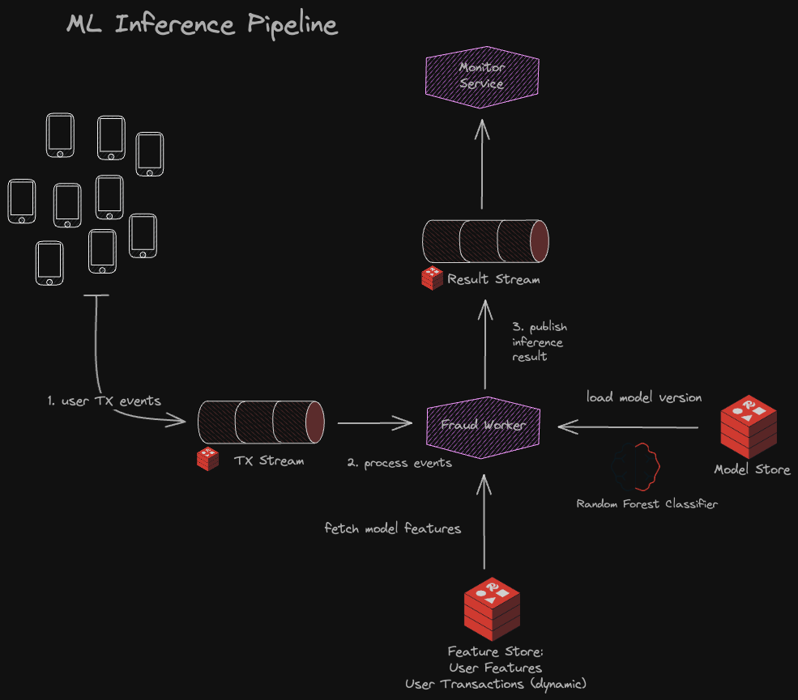

<!-- 
NOTE: All section links use the format "#-section-name" to ensure compatibility with GitHub's anchor link system.
When adding new sections, make sure both the anchor tags and the references follow this format.
-->

<div align="center">
  <a href="https://redis.io/redis-for-ai/">
    
  </a>
  <h1>🚀 Redis ML Inference Pipeline</h1>
  <p><strong>High-Performance Fraud Detection with Redis Stack</strong></p>
  <p>
    <a href="#-architecture">Architecture</a> •
    <a href="#-ml-features">Features</a> •
    <a href="#-quick-start">Quick Start</a> •
    <a href="#-performance">Performance</a> •
    <a href="#-statistics-system">Statistics</a> •
    <a href="#-monitoring-and-metrics">Monitoring</a> •
    <a href="#-advanced-options">Advanced Options</a>
  </p>
</div>

<hr>

<div align="center">
  <h3>Transform your machine learning models into resilient, real-time decision engines</h3>
</div>

This reference architecture demonstrates how to build high-performance, scalable ML inference pipelines using Redis Stack. This solution is specifically designed for fraud detection but can be adapted for any real-time prediction scenario requiring low latency, high throughput, and horizontal scalability.

**Key Benefits:**
- **Low Latency**: <50ms end-to-end processing time
- **High Throughput**: 1000+ transactions/second with multiple workers
- **Horizontal Scaling**: Add workers to linearly increase throughput
- **Resilience**: Automatic recovery from failures using streams and consumer groups
- **Observability**: Built-in latency tracking and performance metrics by test run

<a name="-architecture"></a>
## 🏗️ Architecture

<div align="center">
  
</div>

<br>

This reference implementation leverages Redis Stack's capabilities to create a complete real-time ML inference pipeline:

### 1. 📊 Data Layer
Redis JSON stores transaction data and user profiles with fully indexed fields:
- User profiles contain static information like preferences and risk categories
- Historical transactions provide context for fraud pattern detection
- RediSearch provides high-performance querying across all data types

### 2. 🧮 Feature Layer
Combines static and dynamic features in real-time:
- Pre-computed features stored in Redis are retrieved in microseconds
- On-the-fly calculated features (e.g., spending patterns) use Redis Query Engine
- Efficient vector operations for geospatial or embedding-based features

### 3. 🤖 Model Layer
Stores and manages ML models directly in Redis:
- Versioned model storage with redis-model-store
- Automatic serialization/deserialization of scikit-learn models
- Optimized for fast inference (5-10ms per prediction)

### 4. 🔄 Inference Layer
Stream-based architecture for scalable, resilient processing:
- Redis Streams provide persistence, exactly-once delivery, and fault tolerance
- Consumer groups enable parallel processing across multiple workers
- Configurable batch processing improves throughput for high-volume scenarios

### 5. 📈 Monitoring Layer
Real-time result tracking and performance analysis:
- Run-based metrics segmentation for testing and comparison
- Latency tracking at multiple pipeline stages
- Comprehensive statistics for performance tuning

<a name="-ml-features"></a>
## 💾 ML Features

The feature engineering system combines multiple data sources for comprehensive fraud detection:

<table>
  <tr>
    <th width="18%">Feature Type</th>
    <th width="27%">Examples</th>
    <th width="15%">Source</th>
    <th width="40%">Description</th>
  </tr>
  <tr>
    <td><strong>Static<br>(Profile)</strong></td>
    <td><code>home_location</code><br><code>preferred_card</code><br><code>user_segment</code><br><code>risk_score</code></td>
    <td>Redis JSON</td>
    <td>Precomputed during profile creation, stored with RedisJSON for sub-millisecond access. These provide baseline user behavior patterns.</td>
  </tr>
  <tr>
    <td><strong>Dynamic</strong></td>
    <td><code>transaction_velocity</code><br><code>amount_vs_average</code><br><code>location_deviation</code></td>
    <td>Calculated</td>
    <td>Computed at inference time using RediSearch to quickly aggregate historical data. These capture recent behavior changes that might indicate fraud.</td>
  </tr>
  <tr>
    <td><strong>Transaction</strong></td>
    <td><code>amount</code><br><code>merchant_id</code><br><code>timestamp</code><br><code>device_info</code></td>
    <td>Input Stream</td>
    <td>Provided with each transaction from source systems. These represent the current activity being evaluated for potential fraud.</td>
  </tr>
  <tr>
    <td><strong>Derived</strong></td>
    <td><code>is_home_location</code><br><code>is_preferred_card</code><br><code>time_since_last_txn</code></td>
    <td>Hybrid</td>
    <td>Features created by combining static and transaction data. These provide additional context by relating current activity to known patterns.</td>
  </tr>
</table>

<a name="-quick-start"></a>
## 🚀 Quick Start

### Prerequisites
- Python 3.10+ 
- Redis Stack 7.2+ (or Redis 8.0+)
- Poetry for dependency management

### Installation

```bash
# Clone the repository
git clone https://github.com/yourusername/redis-ml-inference-pipeline
cd redis-ml-inference-pipeline

# Install dependencies
poetry install
```

### Getting Started (Happy Path)

Follow these steps to get the pipeline running with minimal configuration:

1. **Prepare the Environment**
   ```bash
   # Initialize the system (loads data, creates indices, trains model)
   poetry run prepare
   ```

2. **Run an End-to-End Test**
   ```bash
   # Start a complete load test with default settings
   poetry run load-test --tps 10 --duration 30
   ```

That's it! This will:
- Train and store a fraud detection model
- Start an inference worker
- Generate synthetic transactions
- Process them through the ML pipeline
- Display detailed statistics when complete

### Viewing Results

To see detailed statistics for your test run:
```bash
# View statistics for the most recent run
poetry run monitor --stats
```

<a name="-performance"></a>
## 🚄 Performance

The pipeline is optimized for high throughput and low latency:

- **Single Worker**: ~100-200 TPS with ~10ms average latency
- **Parallel Mode**: ~500 TPS with 4 threads per worker
- **Horizontal Scaling**: Linear scaling with additional workers (1000+ TPS with 5+ workers)
- **Batch Processing**: 2-5x throughput improvement with batch sizes of 10-50

<a name="-statistics-system"></a>
## 📊 Statistics System

The statistics system provides comprehensive metrics for each test run:

### Key Features
- **Run-Based Tracking**: All metrics are segregated by unique run ID
- **Complete Metrics**: Captures transactions, latency, throughput, and fraud rates
- **Centralized Storage**: All statistics stored in Redis for persistence
- **Worker Aggregation**: Combines metrics from multiple workers
- **Real-Time Updates**: Statistics available during and after test runs

### Viewing Statistics
```bash
# Show statistics for a specific run
poetry run monitor --stats --run-id your-run-id

# List all available test runs
poetry run monitor --runs

# View statistics for the most recent run
poetry run monitor --stats
```

### Available Metrics
- **Basic Statistics**: Transactions processed, fraud detected, throughput
- **Latency Metrics**: Avg, median, p95, p99, min/max latency
- **Worker Information**: Number of workers, processing modes, thread counts
- **Test Details**: Duration, pattern type, start/end times

<a name="-monitoring-and-metrics"></a>
## 📊 Monitoring and Metrics

The pipeline includes comprehensive monitoring capabilities for real-time analysis and performance tuning:

### Live Monitoring
```bash
# View real-time transaction processing
poetry run monitor
```

### Historical Analysis
```bash
# View detailed statistics for a specific run
poetry run monitor --stats --run-id your-run-id

# List all available runs
poetry run monitor --runs
```

<a name="-advanced-options"></a>
## 🛠️ Advanced Options

### Component-Based Execution

For more granular control, you can run individual components separately:

1. **Start Inference Workers**
   ```bash
   # Start a single worker in standard mode
   poetry run worker
   
   # Start a worker with parallel processing
   poetry run worker --parallel --threads 4
   
   # Start multiple workers
   poetry run worker --workers 3 --parallel
   ```

2. **Generate Test Transactions**
   ```bash
   # Generate a specific number of transactions
   poetry run generate --count 100 --interval 0.1
   
   # Generate continuous traffic with a specific pattern
   poetry run generate --tps 50 --duration 60 --pattern wave
   ```

3. **Monitor Results**
   ```bash
   # Monitor all transactions in real-time
   poetry run monitor
   
   # Show only the latest results
   poetry run monitor --latest --count 20
   ```

### Traffic Patterns

The transaction generator supports different traffic patterns:

- **constant**: Steady stream of transactions at the specified TPS
- **wave**: Sinusoidal pattern that varies the TPS over time
- **spike**: Sudden burst of transactions in the middle of the test
- **random**: Random fluctuations in transaction rate

Example:
```bash
# Generate a wave pattern of transactions
poetry run generate --tps 50 --duration 120 --pattern wave
```

### Worker Processing Modes

The inference worker supports different processing models:

- **Sequential**: Process one transaction at a time (default)
- **Parallel**: Process multiple transactions in parallel using threads
- **Batch**: Process transactions in batches for higher throughput

Example:
```bash
# Run worker in parallel mode with 4 threads
poetry run worker --parallel --threads 4 --batch-size 20
```

<a name="-run-system"></a>
### Run ID System

Each test uses a unique run ID for isolation and tracking:

```bash
# Generate transactions with a specific run ID
poetry run generate --tps 20 --duration 30 --run-id custom-test-1

# View statistics for that run
poetry run monitor --stats --run-id custom-test-1
```

<a name="-configuration"></a>
### Configuration Options

<details>
  <summary><strong>Redis Connection Settings</strong> (click to expand)</summary>
  
  Set these environment variables to connect to a custom Redis instance:
  ```bash
  export REDIS_HOST=your-redis-host
  export REDIS_PORT=your-redis-port
  export REDIS_PASSWORD=your-redis-password
  ```
</details>

<details>
  <summary><strong>Key Configuration Options</strong> (click to expand)</summary>
  
  All settings are in `pipeline/settings.py` and can be overridden with environment variables:
  
  - `NAMESPACE`: Prefix for Redis keys (default: "inference-pipeline")
  - `FRAUD_THRESHOLD`: Detection threshold (default: 0.7)
  - `RAW_DATA_PATH`: Path to transaction data (default: "data/raw/transactions_200.json")
  - `MODEL_NAME`: Name for the model in ModelStore (default: "fraud-detection-model")
  - `TRANSACTION_STREAM`: Name for input transaction stream (default: "transaction_stream")
  - `FRAUD_RESULTS_STREAM`: Name for results stream (default: "fraud_results_stream")
  - `DEFAULT_CONSUMER_GROUP`: Default consumer group name (default: "inference_workers")
  - `MAX_STREAM_LENGTH`: Maximum length of streams before trimming (default: 10000)
  - `RESULT_TTL`: Time-to-live for results in seconds (default: 86400)
</details>

<a name="-command-reference"></a>
## 📜 Command Reference

<details>
  <summary><strong>Worker Command</strong> (click to expand)</summary>
  
  ```bash
  poetry run worker [OPTIONS]
  ```
  
  Options:
  - `--model-version`: Specific model version to use
  - `--batch-size`: Number of messages to process in each batch (default: 10)
  - `--timeout`: Timeout in milliseconds for blocking read (default: 5000)
  - `--workers`: Number of worker processes to start (default: 1)
  - `--parallel`: Process in parallel mode using threads
  - `--threads`: Number of threads to use in parallel mode (default: 4)
  - `--consumer-group`: Consumer group name (default: "inference_workers")
</details>

<details>
  <summary><strong>Generator Command</strong> (click to expand)</summary>
  
  ```bash
  poetry run generate [OPTIONS]
  ```
  
  Options:
  - `--count`: Number of transactions to generate (default: 10)
  - `--interval`: Time interval between transactions in seconds (default: 1.0)
  - `--tps`: Transactions per second (alternative to --interval)
  - `--duration`: Duration in seconds (alternative to --count)
  - `--fraud-ratio`: Ratio of fraudulent transactions (default: 0.1)
  - `--threads`: Number of threads for parallel generation (default: 1)
  - `--pattern`: Traffic pattern to generate (choices: constant, wave, spike, random)
  - `--run-id`: Specific run ID to use (optional, auto-generated if not provided)
</details>

<details>
  <summary><strong>Monitor Command</strong> (click to expand)</summary>
  
  ```bash
  poetry run monitor [OPTIONS]
  ```
  
  Options:
  - `--latest`: Show latest results and exit
  - `--count`: Number of results to display (default: 10)
  - `--interval`: Refresh interval in seconds for live monitoring (default: 2.0)
  - `--run-id`: Filter results by specific run ID
  - `--runs`: List all available test runs
  - `--stats`: Show detailed statistics for a run
</details>

<details>
  <summary><strong>Load Test Command</strong> (click to expand)</summary>
  
  ```bash
  poetry run load-test [OPTIONS]
  ```
  
  Transaction Generator Options:
  - `--tps`: Transactions per second to generate (default: 100.0)
  - `--duration`: Test duration in seconds (default: 60)
  - `--fraud-ratio`: Ratio of fraudulent transactions (default: 0.1)
  - `--pattern`: Traffic pattern to generate (default: constant)
  - `--generator-threads`: Threads for transaction generator (default: 2)
  
  Worker Options:
  - `--workers`: Number of workers to start (default: 2)
  - `--batch-size`: Batch size for processing transactions (default: 10)
  - `--parallel`: Use parallel processing within workers
  - `--worker-threads`: Threads per worker for parallel processing (default: 4)
  - `--model-version`: Specific model version to use
  
  Test Options:
  - `--run-id`: Specific run ID to use (optional)
</details>